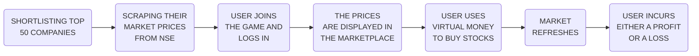
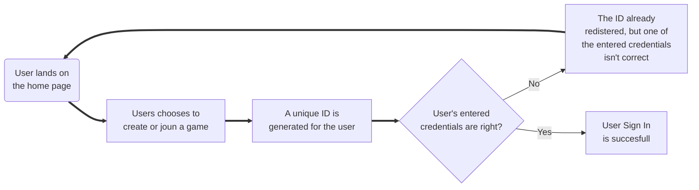
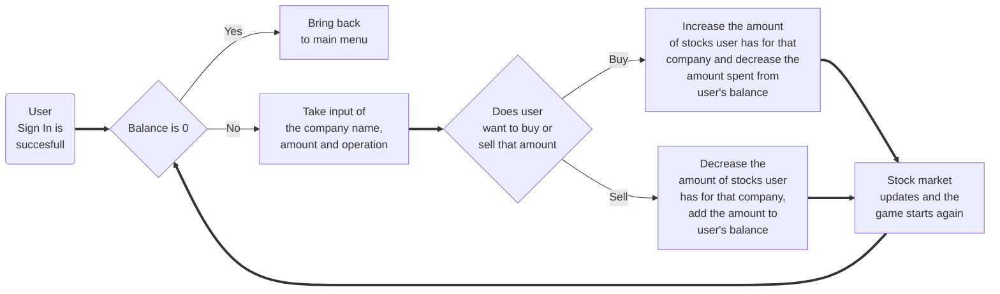

## Stock Market Game Simulation

The aim of our website is to monitor and update the stock prices of several companies in real
time or with every refresh (with a maximum lag <1 minute), and using this data to simulate a Stock
Market Game where a user can use virtual currency to invest and get a hands on experience on the
working of the market.

## Software and Libraries used 
- For Web Scraping-
  - Pymongo: The PyMongo distribution contains tools for interacting with MongoDB databases from Python.
  - Beautiful Soup: Beautiful Soup is a Python package for parsing HTML and XML documents.
  - Requests: Requests is a Python HTTP library. It makes HTTP requests simpler and more human-friendly.
  - Mongoose, Morgan, Lodash

- For DBMS 
  - GCP 
  - MONGODB 
  - ATLAS (To host the MongoDB server)

- Languages Used
  - Python
  - Javascript

- For creating the website
  - NODEJS, Javascript, HTML CSS, Embedded Javascript

## Features-
- Virtual Money
- Real Time Refreshes
- Fully functional User Login system

## Methodology

## User Sign In process

## Game process

## User Interface (Screenshots)

<section>

<h3 align="center">Landing Page </h3>

<h3 align="center">User Sign In Page </h3>

<h3 align="center">Market Place</h3>

<h3 align="center">Buying Selling </h3>
</section>

---
- Some features of the website are still in work. (Ranklist etc.)

