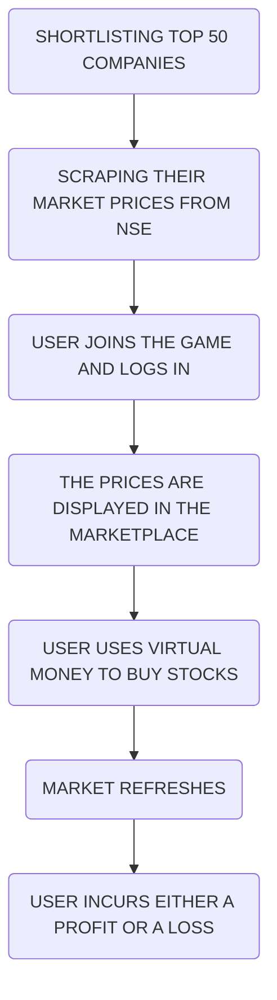
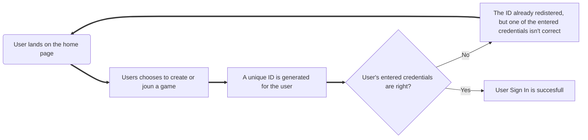
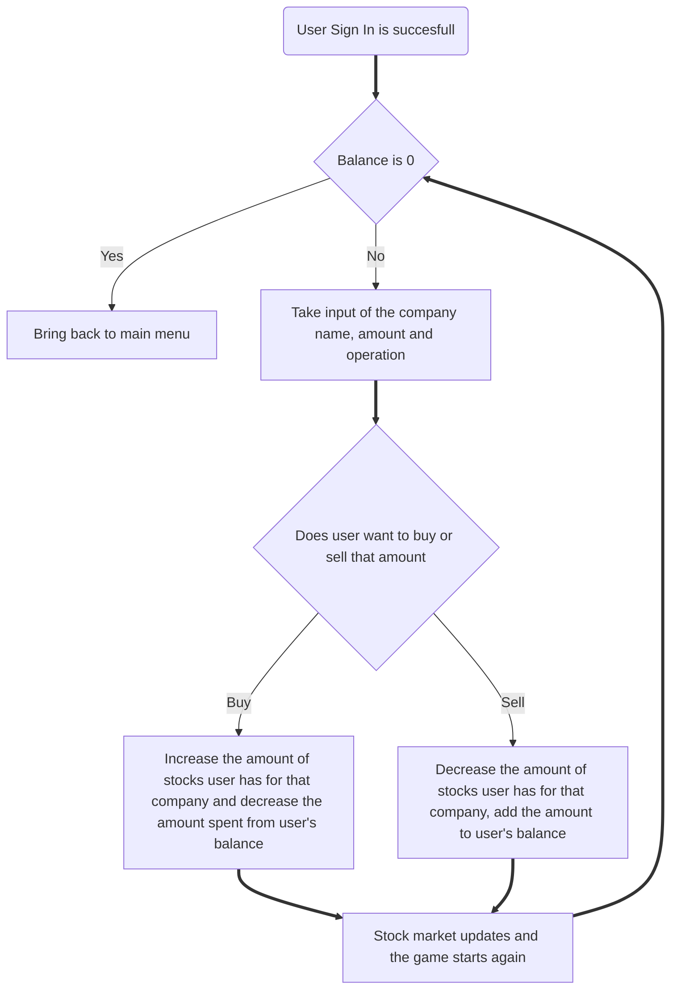

## Stock Market Game Simulation

The aim of our website is to monitor and update the stock prices of several companies in real
time or with every refresh (with a maximum lag <1 minute), and using this data to simulate a Stock
Market Game where a user can use virtual currency to invest and get a hands on experience on the
working of the market.

## Features-
- Virtual Money
- Real Time Refreshes
- Fully functional User Login system

## Methodology

## User Sign In process

## Game process

